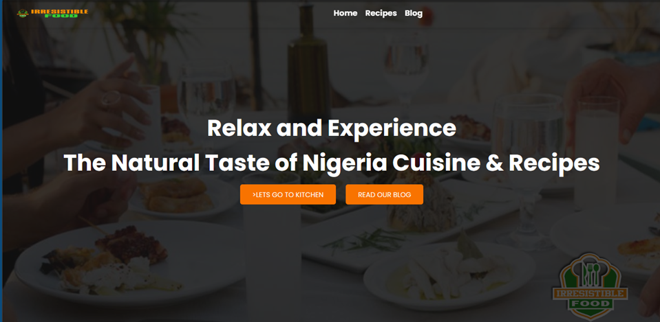

WEBSTACK - PORTFOLIO PROJECT (WEB APPLICATION)

Name of the Project:
WEB APPLICATION - Designed specifically for African Cuisine, Irresistible Food!

List of Team Members: 
Solo: Anthony Etim
Working on the Project Alone

Description of the project:
In this project, I disembarked on creating a Web Application specifically designed for the African Cuisine, Irresistible Food. The Application contains unique and easy-to-implement recipes and more. You can subscribe to the latest News/Recipes. It is easy to use and has a great UI. It is designed to respond and feed into handheld, tap, or desktop devices. 

The Learning Objectives:
The learning objectives of the African Cuisine, IrresistibleFood web application are to help users:
•	Gain an understanding of the cultural significance and history of traditional African cuisine.
•	Learn about the unique ingredients, cooking techniques, and flavors found in African Traditional dishes and also discover the health benefits of traditional African dishes and further develop an appreciation for the diverse and flavorful cuisine of the African continent.
•	Learn about the important role that food plays in African culture, including its significance in celebrations, ceremonies, and daily life.
•	Develop an understanding of the challenges facing traditional African cuisine, such as food insecurity, climate change, and cultural preservation.

Technologies Used: 
The technologies used to complete this project are:
•	HTML -Structuring web pages.
•	BOOTSTRAP -Developing responsive web pages.
•	JS- To make web pages interactive.
•	CSS- Defining the styles for web pages
•	JQUERY - To add animations and interactive elements.

Challenges already identified:
Developing an African cuisine web application faces several challenges. Firstly, limited access to the internet in rural areas makes it difficult for users to access the application. Secondly, the lack of standardization in African cuisine makes it challenging to create a comprehensive database of recipes. Thirdly, limited resources in many African countries hinder the development of such applications. Fourthly, cultural sensitivities must be respected to avoid offending communities. Fifthly, language barriers make it challenging to cater to all users' linguistic needs. Lastly, intellectual property rights for traditional African recipes must be respected to avoid infringement

GitHub:
https://github.com/TonerowEEtim/Irresistible_Food

If You Have Any Questions or Contributions, Feel Free To Reach Me On This Email Address:
anthony.eetim@gmail.com

THE DEMO OF THE WEB APPLICATION

